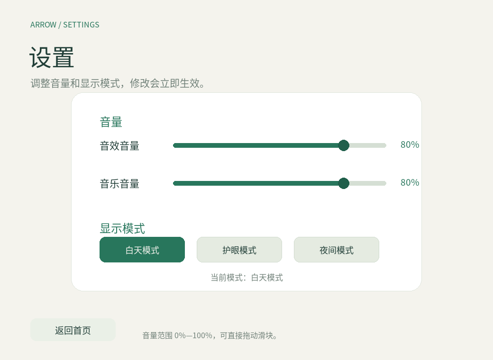
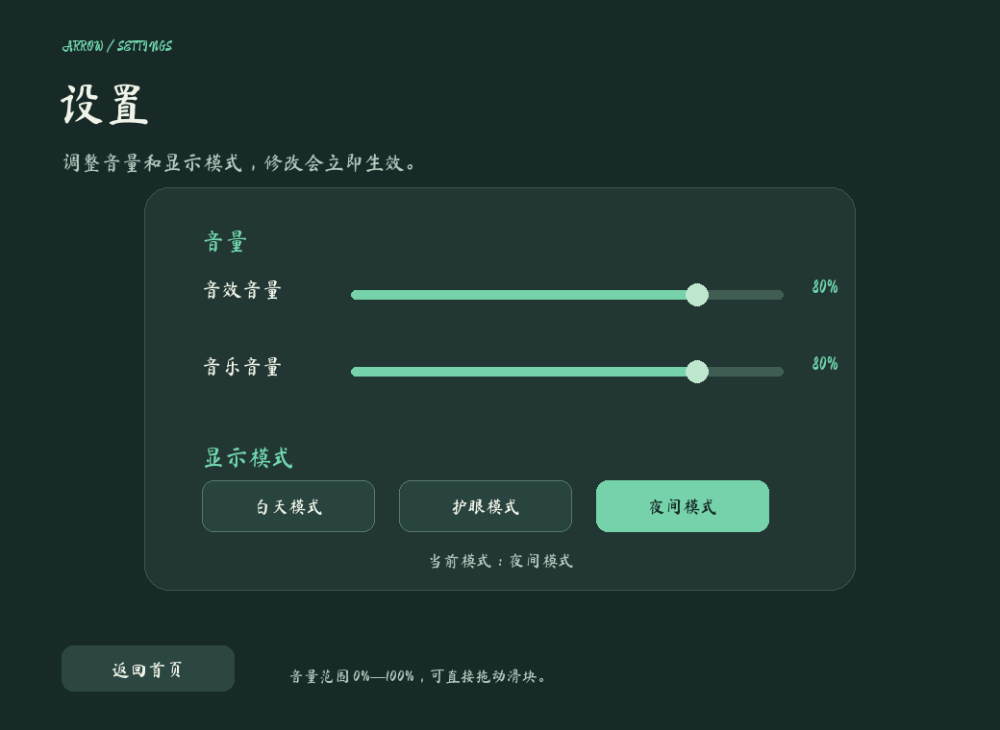

# 一箭又一箭 · Arrow by Arrow

使用 Python / Pygame 实现的单格箭头解谜游戏，用于软件工程课程个人作业。观察箭头方向，按合适的顺序让所有箭头飞出棋盘。

Windows 可执行版本可从 [GitHub Releases](https://github.com/Yi-shang0101/arrow_game/releases/latest) 下载；源码运行和打包方法见下文。

## 安装与运行

可使用 Python 3.12 或 3.14（本次自动化实测版本为 3.12.14），依赖 pygame-ce 2.5.8。需要图形桌面和鼠标。解压整个项目，保留 `assets` 文件夹；不要在压缩包内直接打开程序。

Windows：打开项目文件夹，在地址栏输入 `cmd` 并回车，然后执行：

```bat
python -m venv .venv
.venv\Scripts\python -m pip install -r requirements.txt
.venv\Scripts\python main.py
```

如果电脑的 Python 3.12 已经设为默认版本，也可直接使用：

```bat
python -m pip install -r requirements.txt
python main.py
```

macOS / Linux（需已安装 Python 3.12 和可用图形桌面）：

```sh
python3.12 -m venv .venv
.venv/bin/python -m pip install -r requirements.txt
.venv/bin/python main.py
```

第一次安装依赖需要网络；之后游戏可离线运行，不调用 AI API，不需要密钥。

### Windows 打包

在 PowerShell 中执行：

```powershell
.\build_windows.ps1
```


## 限时评级（按难度配置）

前三关保持原有普通难度规则：

| 完成耗时 t | 结果 |
| --- | --- |
| t ≤ 15 秒 | A |
| 15 < t ≤ 25 秒 | B |
| 25 < t ≤ 35 秒 | C |
| t > 35 秒 | 立即失败 |

新增关卡根据难度增加允许时间，但 A/B/C 仍按各自阈值判定：

| 难度 | 关卡 | A | B | C / 超时 |
| --- | --- | ---: | ---: | ---: |
| 普通 | 1—3 | ≤15秒 | ≤25秒 | ≤35秒 / >35秒失败 |
| 困难 | 4 | ≤25秒 | ≤40秒 | ≤55秒 / >55秒失败 |
| 专家 | 5 | ≤35秒 | ≤55秒 | ≤75秒 / >75秒失败 |


## 关卡选择与成绩保存

首页内容居中，“开始游戏”“选择关卡”“设置”“退出游戏”上下排列，开始游戏按钮尺寸与字号更大，其他按钮保持同尺寸并使用统一悬停高亮。点击“选择关卡”跳转到独立选关页面，点击“设置”进入音量与显示模式页面；选关页面展示全部五关，第一关默认开放，前一关达到 B 或 A 后永久解锁下一关。未解锁关卡不可点击；即使直接调用开始关卡的方法，也会检查解锁条件。

每关记录成功通关的最短时间，并据此显示最佳评级。更慢成绩、C 评级或失败都不会覆盖原有更好记录，也不会重新锁定已经解锁的关卡。若本次拿到 C，结果页可重试、选择关卡或返回首页；之前解锁的后续关卡仍可从首页的“选择关卡”进入后选择。


## 操作与规则

- 左键点击箭头：同一行或列、朝向边界的整条路径无其他箭头，才能飞出。
- 被挡住：箭头前移后返回并变红，失误机会减 1；每关初始 3 次。
- 清空棋盘：A/B 评级可点击“下一关”；C 评级需重试提升到 B。所有成功/失败结果页都可重试、选择关卡或返回首页。
- `R` / 重新开始：重置本关，包括布局、失误次数、提示和动画。
- `H` / 提示：高亮一支当前可消除的箭头 2 秒，不扣失误机会。
- `Esc`：返回首页；`Enter`：在首页开始，在结果页继续。
- 首页“设置”：拖动音效/音乐音量滑块，选择白天、护眼或夜间显示模式；修改立即生效。
- 飞出和碰撞动画期间暂不接受棋盘点击；重开和返回首页仍可使用。
- 点击空格、棋盘外、非左键均不扣次数。最佳成绩和关卡解锁会自动保存。

棋盘逻辑与渲染分离：飞出完成后才清空格子，碰撞不修改棋盘；动画期间锁定棋盘点击，避免重复扣除。

## 游戏截图

截图由实际 pygame-ce 画面生成。





## 资源来源

箭头、布局与界面图形由代码绘制，无原商业游戏素材。游戏界面使用 Google Fonts 组合：标题使用 [Ma Shan Zheng](https://fonts.google.com/specimen/Ma+Shan+Zheng)（马善政体），正文和按钮使用 Noto Serif SC；对应文件为 `assets/MaShanZheng-Regular.ttf` 与 `assets/NotoSerifSC-Regular.ttf`。游戏音效来自于https://mixkit.co/ ，无商业素材。


