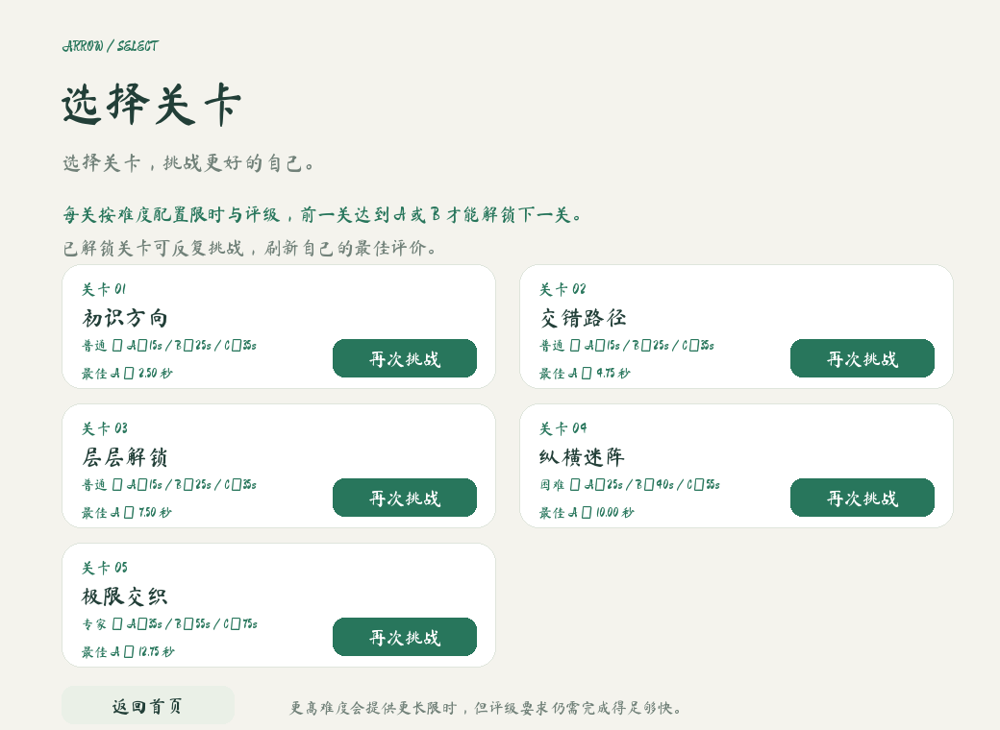
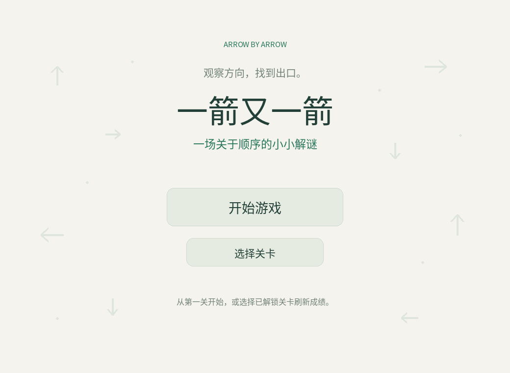
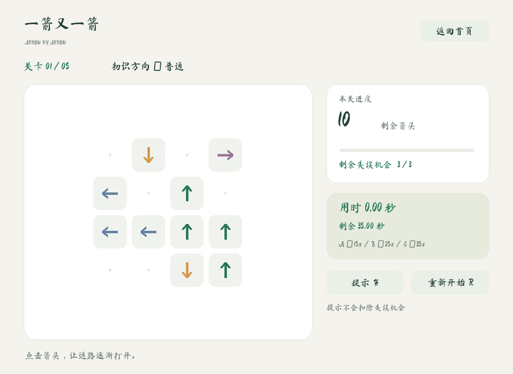
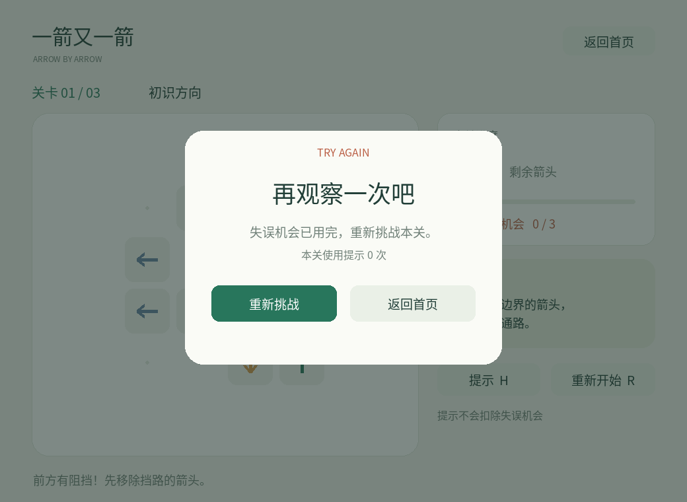
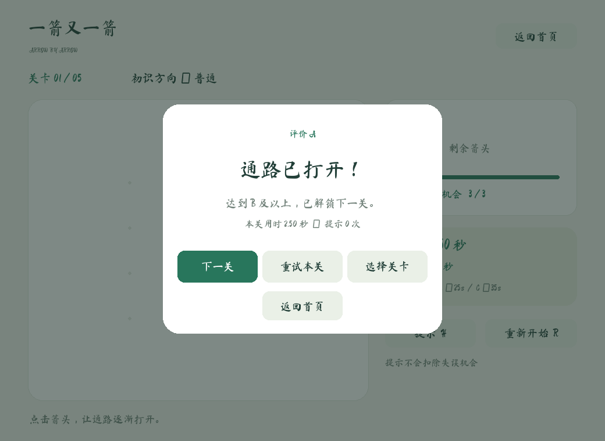

# 一箭又一箭 · Arrow by Arrow

使用 Python / Pygame 实现的单格箭头解谜游戏，用于软件工程课程个人作业。观察箭头方向，按合适的顺序让所有箭头飞出棋盘。

## 安装与运行

可使用 Python 3.12 或 3.14（本次自动化实测版本为 3.12.14），依赖 pygame-ce 2.5.8。需要图形桌面和鼠标。解压整个项目，保留 `assets` 文件夹；不要在压缩包内直接打开程序。

Windows：打开项目文件夹，在地址栏输入 `cmd` 并回车，然后执行：

```bat
python -m venv .venv
.venv\Scripts\python -m pip install -r requirements.txt
.venv\Scripts\python main.py
```

如果电脑的 Python 3.12 已经设为默认版本，也可直接使用：

```bat
python -m pip install -r requirements.txt
python main.py
```

macOS / Linux（需已安装 Python 3.12 和可用图形桌面）：

```sh
python3.12 -m venv .venv
.venv/bin/python -m pip install -r requirements.txt
.venv/bin/python main.py
```

第一次安装依赖需要网络；之后游戏可离线运行，不调用 AI API，不需要密钥。

## 限时评级（每关独立）

| 完成耗时 t | 结果 |
| --- | --- |
| t ≤ 15 秒 | A |
| 15 < t ≤ 25 秒 | B |
| 25 < t ≤ 35 秒 | C |
| t > 35 秒 | 立即失败 |

进入关卡先显示规则页，点击“开始挑战”或按 Enter 后开始计时，最后一支箭头飞出动画完成时结算。观察、提示、碰撞、飞出动画及窗口失去焦点期间均计时，不提供暂停；结果页停止计时。重开和下一关归零。仍保留 3 次失误机制，失误耗尽也会失败。界面显示两位小数，判断使用未格式化的时间，边界按上述规则执行。

飞出动画缩短到每支 0.25 秒，使第三关 30 支箭头的理论最短动画耗时为 7.5 秒，A 评级在规则上可达。

## 关卡选择与成绩保存

首页内容居中，“开始游戏”和“选择关卡”上下排列，开始游戏按钮尺寸与字号更大，鼠标悬停时按钮高亮。点击“选择关卡”跳转到独立选关页面，选关页面展示全部三关，第一关默认开放，前一关曾取得 A 或 B 后永久解锁下一关。未解锁关卡不可点击；即使直接调用开始关卡的方法，也会检查解锁条件。

每关记录成功通关的最短时间，并据此显示最佳评级。更慢成绩、C 评级或失败都不会覆盖原有更好记录，也不会重新锁定已经解锁的关卡。若本次拿到 C，结果页只能重试或回首页；之前解锁的后续关卡仍可从首页的“选择关卡”进入后选择。

进度存放在用户主目录的 `.arrow_by_arrow/progress.json`（Windows 通常是 `C:\Users\你的用户名\.arrow_by_arrow\progress.json`），关闭游戏后保留；更新游戏文件不影响成绩。存档不可读时回到初始进度并显示提示；无法写入时保留本次会话内成绩并提示。测试与截图使用独立内存进度，不写玩家存档。



## 操作与规则

- 左键点击箭头：同一行或列、朝向边界的整条路径无其他箭头，才能飞出。
- 被挡住：箭头前移后返回并变红，失误机会减 1；每关初始 3 次。
- 清空棋盘：A/B 评级可点击“下一关”；C 评级需重试提升到 B。第三关清空后可重试本关或返回首页选关。
- `R` / 重新开始：重置本关，包括布局、失误次数、提示和动画。
- `H` / 提示：高亮一支当前可消除的箭头 2 秒，不扣失误机会。
- `Esc`：返回首页；`Enter`：在首页开始，在结果页继续。
- 飞出和碰撞动画期间暂不接受棋盘点击；重开和返回首页仍可使用。
- 点击空格、棋盘外、非左键均不扣次数。最佳成绩和关卡解锁会自动保存。

## 功能与结构

三关分别是 4×4 / 10 支、5×5 / 19 支、6×6 / 30 支箭头，每关含四种方向。均为原创数据，经过求解器验证。

| 文件 | 用途 |
| --- | --- |
| `main.py` | 中文界面、鼠标事件、动画绘制、主循环 |
| `logic.py` | 路径检测、求解器、游戏状态与动画事务 |
| `progress.py` | 最佳成绩、解锁判定与本地存档 |
| `tests/test_progress.py` | 7 项解锁、最佳成绩与存档测试 |
| `levels.py` | 三个固定关卡 |
| `tests/test_logic.py` | 11 项核心规则测试 |
| `tests/test_timer.py` | 8 项计时、评级边界和超时测试 |
| `tests/test_ui.py` | 6 项界面事件流程测试 |
| `assets/` | 中文字体及字体许可证 |
| `docs/` | 截图、开发记录、测试报告、PSP 表与通关顺序 |

核心规则见 `can_exit()`：从箭头前一格开始，按方向逐格扫描，直到边界。遇到任意箭头即被阻挡，空格不阻挡，身后箭头不参与判断。一次检测复杂度 O(max(行数, 列数))。

棋盘逻辑与渲染分离：飞出完成后才清空格子，碰撞不修改棋盘；动画期间锁定棋盘点击，避免重复扣除。

## 游戏截图

截图由实际 pygame-ce 画面生成。






## 测试

在项目目录执行：

```sh
python -m unittest discover -s tests -v
```

35 项测试已在 Linux / Python 3.12.14 / pygame-ce 2.5.8 环境通过。界面测试使用 SDL dummy 驱动和模拟鼠标事件，可在无桌面环境运行；覆盖三关完整通关、失败重开、重复点击和中途重开。

原始输出见 `docs/test_output.txt`。自动化测试不替代本人试玩：Windows 桌面实机运行、主观动画流畅度以及每关人工试玩，需下载后确认。

重新生成截图：`python docs/capture_demo.py`。

## AIGC、提交记录与课程材料

本项目由 ChatGPT / Codex 辅助生成、调试和验证。真实阶段记录见 `docs/DEVELOPMENT.md`，未虚构学生的人工修改、试玩或耗时。提交前请阅读代码，补充自己的实际运行结果与 PSP 耗时。

交付压缩包的 `history/development.bundle` 保存本次按开发阶段形成的 Git 提交（作者 Codex），并非跨日期模拟提交。解压后，在当前项目目录运行以下命令，即可在相邻目录恢复含提交历史的仓库：

```sh
git clone history/development.bundle ../arrow-game-repo
```

之后在 `arrow-game-repo` 内配置自己的 Git 用户名和邮箱，继续开发并真实提交。当前未上传 GitHub；创建自己的空 GitHub 仓库后，可以在恢复出的仓库中把 `origin` 改为自己的仓库地址并推送。不要在博客里写成已上传。

## 资源来源

箭头、布局与界面图形由代码绘制，无原商业游戏素材。字体使用 [Noto Sans CJK](https://github.com/notofonts/noto-cjk)，文件为 `Sans/OTF/SimplifiedChinese/NotoSansCJKsc-Regular.otf`，按 SIL Open Font License 1.1 分发，许可证随包保留在 `assets/OFL.txt`。

首页不再显示详细规则，玩法、35 秒限时与 ABC 评级统一放在关卡开始前的说明页。初次进入、选关、下一关及重试都先进入说明页；阅读期间不计时，也不接受棋盘点击。

首页“选择关卡”下方提供“退出游戏”，两个按钮均为 280×58、字号21，使用相同悬停高亮逻辑；点击退出会正常结束主循环并关闭窗口。

## 音乐与音效

`assets/audio/` 内置本次提供的 7 个音频文件：

| 文件 | 使用场景 |
| --- | --- |
| `主菜单音乐.mp3` | 首页、选关页和规则说明页循环播放 |
| `进行游戏音乐.mp3` | 点击“开始挑战”后循环播放 |
| `倒计时.wav` | 每次开始挑战时播放，并在通关、失败、返回或重开时停止 |
| `箭头飞出.wav` | 点击畅通箭头时播放 |
| `箭头被阻挡.wav` | 点击被阻挡箭头时播放 |
| `游戏成功.wav` | 关卡通关时播放 |
| `游戏失败.wav` | 失误耗尽或超时失败时播放 |

音频文件由用户提供并随项目打包；程序启动时自动加载。若电脑没有可用音频设备，游戏会自动静音但仍可正常运行。
