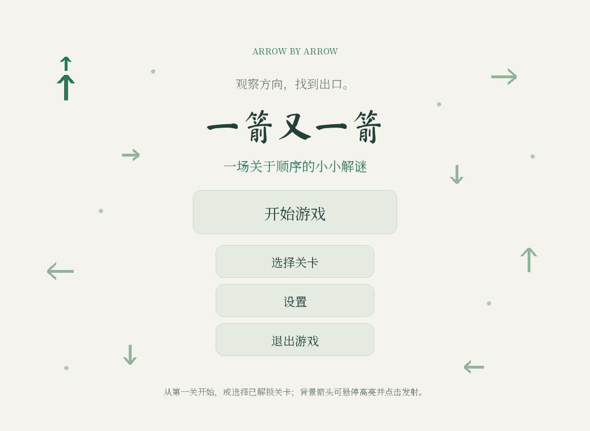
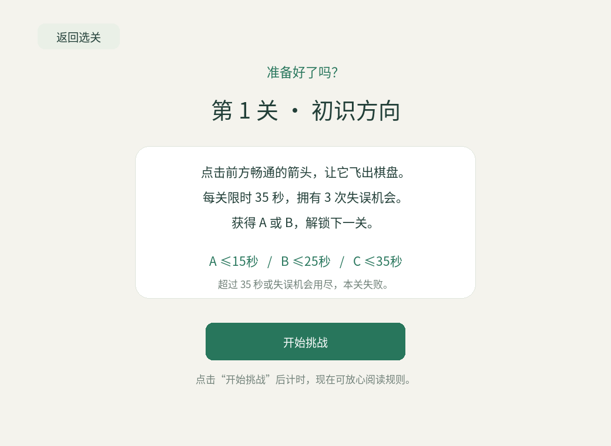

# “一箭又一箭”小游戏开发记录

## 作业信息

| 项目 | 内容 |
| --- | --- |
| 课程 | [H202601 软件工程与软件工程实践](https://edu.cnblogs.com/campus/fzu/2026-01SoftwareEngineeringandSoftwareEngineeringPractice) |
| 作业 | 2026 秋软件工程个人作业（第二次） |
| 作业要求链接 | 【待补充老师布置本次作业的具体链接】 |
| 学号 | 102401115 |
| GitHub 仓库 | https://github.com/Yi-shang0101/arrow_game |
| 开发工具 | Python、Pygame-ce、ChatGPT/Codex |

> 本文是提交前草稿。GitHub 链接、PSP 实际时间、Windows 实机试玩结果和个人心得中的主观内容，需要根据本人实际情况补充，不能直接把“待填写”当作最终答案。

## 一、项目展示

### 1.1 项目简介

“一箭又一箭”是一款基于 Python/Pygame 实现的点击式箭头解谜小游戏。棋盘中放置朝向上、下、左、右的箭头，玩家需要观察每个箭头前方的路径，按照合适的顺序点击，使所有箭头依次飞出棋盘。

当箭头与棋盘边界之间没有其他箭头时，箭头可以飞出并消失；如果前方存在其他箭头，则本次点击失败，箭头产生碰撞反馈并消耗一次失误机会。清空棋盘后进入通关页面，失误机会耗尽或超过本关时间限制时进入失败页面。

### 1.2 运行方法

在解压后的项目目录执行：

```bash
python -m pip install -r requirements.txt
python main.py
```

项目依赖为 `pygame-ce==2.5.8`。运行时需要保留 `assets/` 目录，因为其中包含字体、音乐和音效资源。

### 1.3 界面截图








## 二、主要功能

本项目实现了作业要求中的基础玩法，并加入了一些扩展功能：

1. 开始界面、选关界面、规则说明页、游戏界面、通关页面和失败页面；
2. 上、下、左、右四种方向的箭头；
3. 路径阻挡判断、飞出动画和碰撞反馈；
4. 三次失误机会、重新开始、返回首页和返回选关；
5. 五个固定关卡以及关卡选择和最佳成绩保存；
6. 按难度设置时间评级，达到前一关 B 或 A 才能解锁下一关；
7. H 键提示当前可飞出的箭头，A 键或“自动求解”按钮自动完成当前关卡；
8. 设置页中的音乐音量、音效音量和白天/护眼/夜间模式；
9. 主菜单音乐、游戏音乐、箭头音效、按钮音效、成功音效和随机失败音效；
10. 首页背景箭头支持鼠标悬停高亮，点击后沿箭头方向播放装饰性发射动画；
11. 标题使用 Ma Shan Zheng，正文和按钮使用 Noto Serif SC，并保留中文字体回退机制。

## 三、游戏规则与关卡设计

### 3.1 路径判断规则

每个箭头使用一个二维数组单元表示：`U` 表示向上，`D` 表示向下，`L` 表示向左，`R` 表示向右，`None` 表示空格。

判断箭头是否可以飞出时，从当前箭头的下一格开始，沿箭头方向逐格检查，直到棋盘边界：

- 没有遇到其他箭头：可以飞出；
- 遇到任意箭头：不能飞出，并产生碰撞反馈；
- 当前箭头本身不参与阻挡判断；
- 箭头后方的内容不影响当前判断。

核心判断可以概括为：

```text
检查当前箭头的方向
从当前箭头的下一格开始扫描
如果扫描途中遇到箭头，返回“被阻挡”
扫描到边界仍未遇到箭头，返回“可以飞出”
```

单次路径检测的时间复杂度为 `O(max(行数, 列数))`。关卡规模较小，能够满足实时鼠标操作的需要。

### 3.2 关卡数据

| 关卡 | 名称 | 棋盘 | 箭头数量 | 难度 |
| --- | --- | --- | ---: | --- |
| 1 | 初识方向 | 4×4 | 10 | 普通 |
| 2 | 交错路径 | 5×5 | 19 | 普通 |
| 3 | 层层解锁 | 6×6 | 30 | 普通 |
| 4 | 纵横迷阵 | 7×7 | 40 | 困难 |
| 5 | 极限交织 | 8×8 | 51 | 专家 |

所有关卡都经过程序求解器验证，至少存在一条可以清空棋盘的顺序。

### 3.3 时间评级

| 难度 | A 评价 | B 评价 | C 评价 | 失败条件 |
| --- | ---: | ---: | ---: | --- |
| 普通 | ≤15 秒 | ≤25 秒 | ≤35 秒 | >35 秒 |
| 困难 | ≤25 秒 | ≤40 秒 | ≤55 秒 | >55 秒 |
| 专家 | ≤35 秒 | ≤55 秒 | ≤75 秒 | >75 秒 |

只有前一关达到 A 或 B，才会解锁下一关。C 评价可以保留成绩并重新挑战，但不能解锁下一关。

## 四、程序结构与实现思路

### 4.1 文件组织

| 文件 | 作用 |
| --- | --- |
| `main.py` | Pygame 窗口、页面绘制、鼠标键盘事件、动画和主循环 |
| `logic.py` | 方向判断、路径检测、求解器、计时和游戏状态 |
| `levels.py` | 五个关卡的棋盘数据和难度配置 |
| `progress.py` | 最佳成绩、解锁状态和本地 JSON 存档 |
| `tests/` | 逻辑、计时、存档、UI 和音频自动化测试 |
| `assets/` | 字体、音乐和音效资源 |

程序将游戏逻辑与界面绘制分开。`logic.py` 不依赖 Pygame，因此可以单独测试路径判断、求解和计时；`main.py` 只负责把逻辑状态绘制出来并处理输入。

### 4.2 游戏状态

程序主要使用以下状态：

```text
MENU          首页
SELECT        选择关卡
READY         关卡规则说明
SETTINGS      设置页
PLAYING       游戏进行中
LEVEL_CLEAR   单关通关
GAME_OVER     游戏失败
ALL_CLEAR     全部通关
```

进入 `PLAYING` 后才开始计时。箭头飞出动画或碰撞动画期间，棋盘点击会被锁定，避免同一帧重复处理。最后一支箭头的飞出动画完成后，程序根据实际用时计算评级并保存最佳成绩。

### 4.3 自动求解

自动求解功能复用关卡验证使用的 `solve()` 函数。求解器不断查找当前可以直接飞出的箭头，将其加入结果序列并从临时棋盘中移除，直到所有箭头被清空。

```text
复制当前棋盘
while 棋盘中仍有箭头：
    查找所有当前可飞出的箭头
    如果没有可飞出的箭头，返回无解
    移除可飞出的箭头并记录坐标
返回一条可行顺序
```

点击“自动求解 A”后，程序不会瞬间跳过关卡，而是按照正常飞出动画逐步执行，因此仍然会计时、播放箭头音效并进行正常评级。自动求解期间会锁定棋盘手动点击，但重新开始和返回首页仍然有效。

## 五、AIGC 使用过程

本项目使用 ChatGPT/Codex 辅助需求拆解、编码、调试、测试和文档整理。下面记录三次具有代表性的协作过程，提交博客时可以配合自己的聊天截图进一步说明。

| 子任务 | 使用的 AIGC | AI 完成内容 | 验证或修改结果 |
| --- | --- | --- | --- |
| 路径检测和游戏逻辑 | ChatGPT/Codex | 分析四个方向的扫描规则，生成 `can_exit()`、碰撞反馈和状态模型 | 用四方向边界、远距离阻挡、后方箭头等测试验证；发现模拟浮点坐标问题后，在坐标换算处加入整数转换 |
| 关卡与评级系统 | ChatGPT/Codex | 设计三关基础布局，后续生成 7×7 困难关和 8×8 专家关，并加入按难度配置的 A/B/C 阈值 | 使用 `solve()` 验证五关可解；增加难度评级、B 评价解锁和旧存档迁移测试 |
| 界面、音频和交互 | ChatGPT/Codex | 完成菜单、选关、设置、结果页、音乐音效、字体加载、自动求解和背景箭头互动 | 通过模拟鼠标事件和 SDL dummy 环境测试；根据截图调整按钮位置、字体回退和背景箭头命中区域 |

AI 生成代码后仍需要阅读和验证。尤其是关卡是否真的可解、计时是否在动画期间正确累计、Windows 是否能找到资源，都不能只依赖生成结果。

## 六、测试过程与结果

### 6.1 作业要求中的基础测试

| 编号 | 测试内容 | 预期结果 | 当前自动化结果 |
| --- | --- | --- | --- |
| T01 | 点击前方无阻挡的箭头 | 箭头飞出并消失 | 通过 |
| T02 | 点击前方有阻挡的箭头 | 箭头不消失，失误次数减 1 | 通过 |
| T03 | 点击边缘且朝向棋盘外的箭头 | 正常飞出，不越界 | 通过 |
| T04 | 消除本关全部箭头 | 显示通关并进入下一关 | 通过 |
| T05 | 失误次数耗尽 | 显示失败并允许重新开始 | 通过 |
| T06 | 游戏进行中重新开始 | 棋盘和失误次数恢复 | 通过 |

### 6.2 自动化测试

在项目目录执行：

```bash
python -m unittest discover -s tests -v
```

当前测试结果为 **48 项通过**，覆盖以下内容：

- 四方向边界和阻挡判断；
- 五关求解与自动求解流程；
- 普通、困难、专家评级阈值；
- B 评价解锁和旧版三关存档迁移；
- 超时、碰撞、重开、返回和结果页流程；
- 音频资源、随机失败音效和结果音效停止；
- 设置页滑块、三种主题和字体资源；
- 首页背景箭头悬停命中与沿方向发射。

自动化测试环境为 Linux、Python 3.12.14 和 pygame-ce 2.5.8。Windows Python 实机运行、每关人工试玩和主观动画流畅度需要本人在提交前再次确认。

## 七、PSP 表格

下面的时间不能由 AI 代填，请根据自己的真实记录填写：

| 任务 | 预计耗时（小时） | 实际耗时（小时） | 差异（小时） |
| --- | ---: | ---: | ---: |
| 需求分析与游戏设计 | 待填写 | 待填写 | 待填写 |
| Python 与图形库学习 | 待填写 | 待填写 | 待填写 |
| 游戏界面实现 | 待填写 | 待填写 | 待填写 |
| 路径与碰撞逻辑实现 | 待填写 | 待填写 | 待填写 |
| 关卡设计 | 待填写 | 待填写 | 待填写 |
| AIGC 辅助开发 | 待填写 | 待填写 | 待填写 |
| 测试与修改 | 待填写 | 待填写 | 待填写 |
| README 与博客撰写 | 待填写 | 待填写 | 待填写 |
| 合计 | 待填写 | 待填写 | 待填写 |

## 八、心得体会（初稿）

这次作业让我把一个看起来比较简单的点击游戏拆分成了多个软件工程问题：需求分析、数据结构设计、路径检测、状态管理、动画处理、音频管理、存档和测试。最核心的逻辑并不是绘制箭头，而是准确判断箭头前方的路径，并保证箭头飞出动画完成后再修改棋盘状态。

AIGC 在需求拆解、代码框架、测试用例和界面调整方面提高了开发效率，但生成代码不能直接当作最终答案。例如，关卡必须实际验证是否可解，动画期间的输入必须锁定，计时需要考虑最后一支箭头的动画时间，字体资源也要考虑 Windows 环境中的路径和字形支持。通过测试和截图检查，我对代码的理解比单纯复制代码更深入。

本项目还存在需要继续完善的地方：需要在 Windows 上完成完整试玩，补充真实 PSP 时间，检查不同分辨率下的布局，并将项目上传到自己的 GitHub 仓库。后续如果继续开发，可以增加随机生成可解关卡、撤销操作和更详细的成绩统计。

> 提交前请把上面内容改成自己的真实感受，尤其是“我遇到的具体问题”和“我实际做了哪些修改”。

## 九、提交前检查清单

- [ ] 补充本次作业的具体链接；
- [ ] 确认学号无误；
- [ ] 填写自己的 GitHub 仓库链接；
- [ ] 在 Windows 上安装依赖并实际运行；
- [ ] 手动试玩五个关卡，记录真实结果；
- [ ] 填写 PSP 预计时间、实际时间和差异；
- [ ] 添加至少三次真实 AIGC 对话截图或摘录；
- [ ] 检查截图、音频和字体资源是否全部提交；
- [ ] 确认 GitHub 有多次有意义的 Commit；
- [ ] 删除或改写所有不符合本人实际情况的占位说明。
